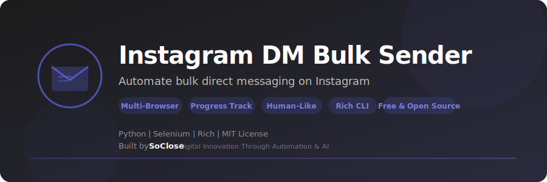

<p align="center">
  
</p>

<p align="center">
  <strong>Automate bulk direct messaging on Instagram — intelligent outreach with progress tracking.</strong>
</p>

<p align="center">
  <a href="LICENSE"></a>
  <a href="https://www.python.org/downloads/"></a>
  
  <a href="https://www.selenium.dev/"></a>
  <a href="https://github.com/SoCloseSociety/InstagramMpBulk/stargazers"></a>
  <a href="https://github.com/SoCloseSociety/InstagramMpBulk/issues"></a>
  <a href="https://github.com/SoCloseSociety/InstagramMpBulk/network/members"></a>
</p>

<p align="center">
  <a href="#quick-start">Quick Start</a> &bull;
  <a href="#key-features">Features</a> &bull;
  <a href="#configuration">Configuration</a> &bull;
  <a href="#faq">FAQ</a> &bull;
  <a href="#contributing">Contributing</a>
</p>

---

## What is Instagram DM Bulk Sender?

**Instagram DM Bulk Sender** is a free, open-source **Instagram automation tool** built with Python and Selenium. It automates sending direct messages to multiple Instagram profiles from a CSV list. Instead of messaging contacts one by one, this bot handles the entire process with human-like delays and progress tracking.

Whether you're doing outreach, networking, or community engagement, this tool saves hours of manual work while keeping your account safe with intelligent delay patterns.

### Who is this for?

- **Growth Hackers** running DM outreach campaigns at scale
- **Digital Marketers** engaging with prospects and influencers
- **Community Managers** sending announcements to members
- **Startup Founders** doing cold outreach to potential customers
- **Freelancers** reaching out to potential clients
- **Content Creators** building relationships with their audience

### Key Features

- **Bulk DM Sending** - Automated messaging to multiple Instagram profiles
- **Progress Tracking** - Tracks sent messages, resume where you left off
- **Secure Credentials** - Environment variables via .env file (never hardcoded)
- **Multi-Browser** - Firefox & Chrome support with automatic driver management
- **Human-Like Delays** - Randomized timing between actions (8-15 seconds)
- **Auto-Save** - Progress saved after each message
- **Branded CLI** - Beautiful terminal interface powered by Rich
- **Cross-Platform** - Works on Windows, macOS, and Linux
- **Free & Open Source** - MIT license, no API key required

---

## Quick Start

### Prerequisites

| Requirement | Details |
|-------------|---------|
| **Python** | Version 3.9 or higher ([Download](https://www.python.org/downloads/)) |
| **Firefox or Chrome** | Latest version installed |
| **Instagram Account** | A valid Instagram account |

### Installation

```bash
# 1. Clone the repository
git clone https://github.com/SoCloseSociety/InstagramMpBulk.git
cd InstagramMpBulk

# 2. (Recommended) Create a virtual environment
python -m venv venv

# Activate it:
# Windows:
venv\Scripts\activate
# macOS / Linux:
source venv/bin/activate

# 3. Install dependencies
pip install -r requirements.txt
```

### Configure

```bash
cp .env.example .env
```

Edit `.env` with your Instagram credentials:

```env
INSTAGRAM_EMAIL=your_email@example.com
INSTAGRAM_PASSWORD=your_password
```

### Set Up Your Campaign

1. Add target usernames to `profile_links.csv` (one per line):

```csv
username1
username2
username3
```

> Both plain usernames and full Instagram URLs are supported.

2. Write your message in `message.txt`:

```
Hello!
I'd love to connect with you.
```

### Run

```bash
python main.py
```

The bot will open a browser, log in, and start sending messages. If 2FA is required, complete it manually in the browser then press ENTER to continue.

---

## How It Works

```
profile_links.csv          message.txt
       │                        │
       ▼                        ▼
┌─────────────────────────────────────┐
│         SoClose DM Engine           │
│                                     │
│  1. Launch browser                  │
│  2. Login to Instagram              │
│  3. For each profile:               │
│     → Navigate to profile           │
│     → Click "Message"               │
│     → Type & send message           │
│     → Save progress                 │
│  4. Report results                  │
└─────────────────────────────────────┘
       │
       ▼
already_send_message.csv
```

---

## Configuration

| Variable | Default | Description |
|----------|---------|-------------|
| `INSTAGRAM_EMAIL` | — | Instagram login email |
| `INSTAGRAM_PASSWORD` | — | Instagram login password |
| `BROWSER` | `firefox` | Browser to use (`firefox` or `chrome`) |
| `HEADLESS` | `false` | Run browser without visible window |
| `MESSAGE_FILE` | `message.txt` | Path to message template |
| `PROFILES_FILE` | `profile_links.csv` | Path to target profiles CSV |
| `SENT_FILE` | `already_send_message.csv` | Sent messages tracking file |
| `MAX_MESSAGES` | `10000` | Maximum messages per session |
| `MIN_DELAY` | `8` | Minimum delay between actions (seconds) |
| `MAX_DELAY` | `15` | Maximum delay between actions (seconds) |

---

## Project Structure

```
InstagramMpBulk/
├── main.py                    # Main automation script
├── requirements.txt           # Python dependencies
├── .env.example               # Configuration template
├── message.txt                # Message template
├── profile_links.csv          # Target profiles list
├── already_send_message.csv   # Progress tracking
├── assets/
│   └── banner.svg             # Project banner
├── LICENSE                    # MIT License
├── README.md                  # This file
├── CONTRIBUTING.md            # Contribution guidelines
└── .gitignore                 # Git ignore rules
```

---

## Troubleshooting

### Browser driver issues

```bash
pip install --upgrade webdriver-manager
```

### Login fails

1. Check your credentials in `.env`
2. Instagram may require 2FA — complete it manually in the browser
3. Wait for the login to complete, then press ENTER

### Messages not sending

1. Instagram may have changed its UI — open an issue
2. Your account may be temporarily restricted — wait a few hours
3. Try increasing delay values in `.env`

---

## FAQ

**Q: Is this free?**
A: Yes. Instagram DM Bulk Sender is 100% free and open source under the MIT license.

**Q: Do I need an API key?**
A: No. This tool uses browser automation (Selenium), no API key needed.

**Q: How many messages can I send?**
A: The default limit is 10,000 per session. Instagram may restrict your account if you send too many too quickly — use reasonable delays.

**Q: Are my credentials safe?**
A: Credentials are stored in a local `.env` file that is gitignored. They are never uploaded or shared.

**Q: Can I use Chrome instead of Firefox?**
A: Yes. Set `BROWSER=chrome` in your `.env` file.

**Q: Does it work on Mac / Linux?**
A: Yes. Fully cross-platform on Windows, macOS, and Linux.

---

## Alternatives Comparison

| Feature | Instagram DM Bulk | Manual DMs | Paid DM Tools |
|---------|-------------------|------------|---------------|
| Price | **Free** | Free | $30-100/mo |
| Bulk sending | Yes | No | Yes |
| Progress tracking | Yes | Manual | Yes |
| Open source | Yes | N/A | No |
| API key required | No | No | Varies |
| Human-like delays | Yes | N/A | Yes |
| Cross-platform | Yes | Yes | Web only |

---

## Contributing

Contributions are welcome! Please read the [Contributing Guide](CONTRIBUTING.md) before submitting a pull request.

---

## License

This project is licensed under the [MIT License](LICENSE).

---

## Disclaimer

This tool is provided for **educational and informational purposes only**. Automated messaging may violate Instagram's Terms of Service. Use responsibly and at your own risk. The authors are not responsible for any consequences resulting from the use of this software.

---

<p align="center">
  <strong>If this project helps you, please give it a star!</strong><br>
  It helps others discover this tool.<br><br>
  <a href="https://github.com/SoCloseSociety/InstagramMpBulk">
    
  </a>
</p>

<br>

<p align="center">
  <sub>Built with purpose by <a href="https://soclose.co"><strong>SoClose</strong></a> &mdash; Digital Innovation Through Automation & AI</sub><br>
  <sub>
    <a href="https://soclose.co">Website</a> &bull;
    <a href="https://linkedin.com/company/soclose-agency">LinkedIn</a> &bull;
    <a href="https://twitter.com/SoCloseAgency">Twitter</a> &bull;
    <a href="mailto:hello@soclose.co">Contact</a>
  </sub>
</p>
